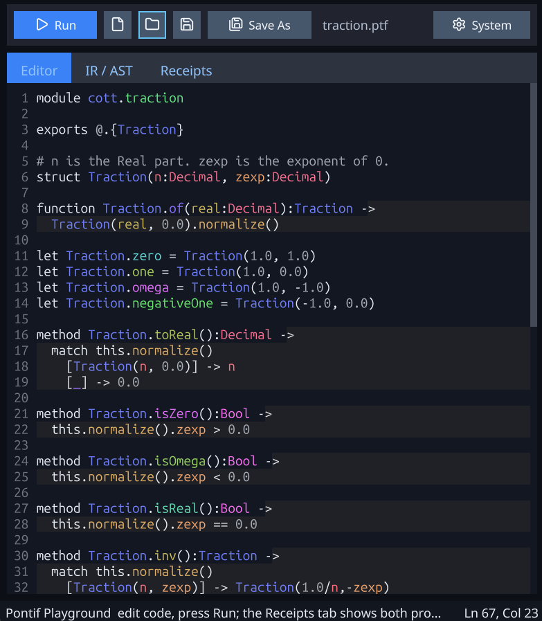
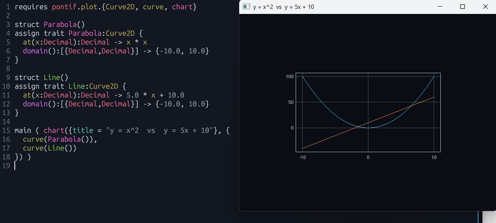
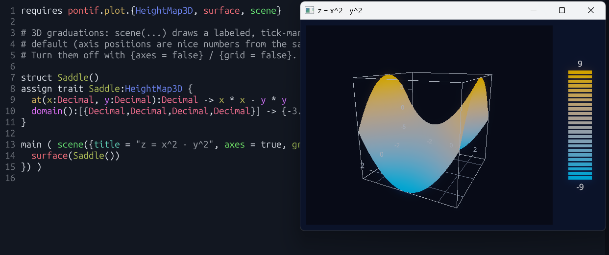
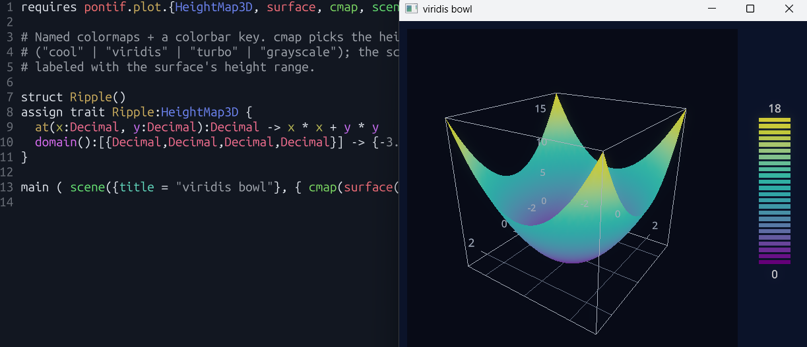
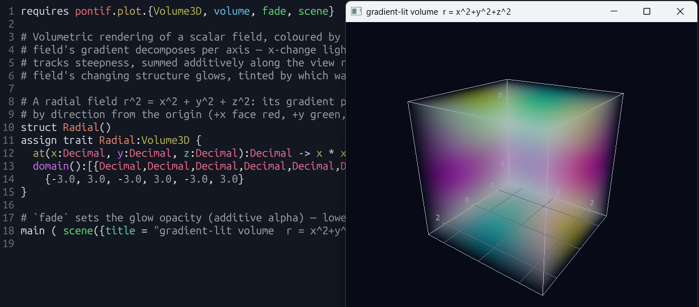

# Pontif Framework



An experimental typed language built on GraalVM's Truffle, where **declared
types are claims the compiler proves or rejects** — never annotations it
trusts. A single symbolic-predicate engine drives refinement, multi-dispatch,
traits, pattern matching, type extension, and synthesis; they are not five
subsystems bolted together but one idea seen from different angles. The name is
the thesis: the compiler *pontificates*, and is held to its word — it is never
allowed to lie.

## Contents

- [A quick example](#a-quick-example)
- [Function dispatching with refined types](#function-dispatching-with-refined-types)
- [Structs and methods](#structs-and-methods)
- [Traits — alternative interfaces](#traits--alternative-interfaces)
- [Type extension — a richer type](#type-extension--a-richer-type)
- [Multiple polymorphism models](#multiple-polymorphism-models)
- [Generics (Type Parameters)](#generics-type-parameters)
- [Streams](#streams)
- [Braces, Brackets, Parenthesis](#braces-brackets-parenthesis)
- [Operator overloading](#operator-overloading)
- [Proofs and synthesis](#proofs-and-synthesis)
- [Reflecting a function into its AST](#reflecting-a-function-into-its-ast)
- [Conservation receipts — the second ledger](#conservation-receipts--the-second-ledger)
- [The math library](#the-math-library)
- [Actions and events](#actions-and-events)
- [The GUI framework](#the-gui-framework)
- [Plotting](#plotting)
- [3D shapes — SDF composition](#3d-shapes--sdf-composition-pontifshape)
- [GPU compute kernels](#gpu-compute-kernels-on-gpu)
- [One inference engine, every stage](#one-inference-engine-every-stage)
- [The compiler](#the-compiler)
- [Source code explained](#source-code-explained)
- [Status](#status)
- [The `pontif` CLI](#the-pontif-cli)
- [Build and test](#build-and-test)
- [License](#license)

## A quick example

```pontif
module ledger

struct Account(balance:[Int:@>=0])
struct Txns(amount:Int, rest:[Txns|Done])
struct Done()

method Account.deposit(n:Int):Account -> match n {
  [@>0]  -> Account(this.balance + n)
  [@<=0] -> this
}

function totalIn(ts:[Txns|Done]):Int -> match ts {
  [Txns] -> ts.amount + totalIn(ts.rest)
  [Done] -> 0
}

Account(0).deposit(totalIn(Txns(100, Txns(50, Done())))).balance   # → 150
```

Most of the language is already on this page:

- **`module ledger`** names the file's module. **`Txns` / `Done`** are an
  inductive list — a value is either a `Txns` (an amount plus the rest of the
  list) or the empty `Done`; recursion over that union is how `totalIn` folds it.
- **`struct Account(balance:[Int:@>=0])`** declares a record whose `balance`
  field is a *refined* type: an `Int` that is provably `>= 0`. The `[...]` wrap a
  type; the predicate inside is a real proof obligation, not a comment. A
  construction that can't satisfy it is a compile error.
- **`@`** is the subject of the enclosing refinement — the value being described
  or matched. In `match n { [@>0] -> … }`, `@` *is* `n`; in `[Int:@>=0]`, `@` is
  the field's value. Each refinement binds its own `@`.
- **`method Account.deposit`** is namespaced to `Account` (more below). **`this`**
  is its receiver — distinct from `@`.
- **`match`** arms *are types*: `[@>0]` and `[@<=0]` partition every `Int`, and
  the compiler checks the partition is total. `[Txns]` / `[Done]` discriminate
  the union — the canonical sum-type fold, no tag field, no default arm.

Everything below is an elaboration of these moves.

## Function dispatching with refined types

Sorts narrow by predicate, dispatch selects on the narrowing, and declared
returns are proof obligations:

```pontif
function factorial(n:[Int:0])  :[Int:@>=1] -> 1
function factorial(n:[Int:@>0]):[Int:@>=1] -> n * factorial(n-1)

function inc(x:[Int:@>=1]):[Int:@>1] -> x + 1

function sign(n:Int):Int -> match n {
  [@<0 ] -> -1
  [@==0] ->  0
  [@>0 ] ->  1
}

factorial(5) + inc(4) + sign(-7)   # → 124
```

- **Overloads dispatch on the narrowing.** `factorial`'s two clauses are selected
  by which sort the argument satisfies (`[Int:0]` vs `[Int:@>0]`), and *provable
  overlap is rejected at registration* — multi-dispatch is unordered and
  unambiguous. (Contrast `match`, which is ordered top-to-bottom with overlap
  allowed; the two are deliberately different tools.)
- **A declared return is a claim.** `inc`'s `[Int:@>1]` says "the result exceeds
  1." The compiler discharges `x >= 1 ⟹ x + 1 > 1` at compile time: the
  **receipt-graph engine** drafts an obligation graph from the body (`Drafter`),
  an issuer closes it with sign / linear-bound / integer reasoning
  (`BuiltinIssuer`), and a notary accepts only what it cannot refute (`Notary`).
  A false claim — or a true one the engine can't prove and you supply no `proof`
  for — rejects the program. Both `factorial` clauses carry the same claim,
  `[Int:@>=1]`, and it closes *inductively*: the recursive call's own
  `[Int:@>=1]` is taken as the induction hypothesis, so `n > 0` (from the
  parameter sort) and `factorial(n-1) >= 1` together discharge
  `n * factorial(n-1) >= 1`.
- **Match totality is enforced as a conservation rule.** A non-exhaustive match
  is a compile error *with the uncovered witness*; undecidable coverage demands a
  default arm. `_` desugars to the precise complement where computable.

Narrowing extends to the `Decimal` domain (sign, range, and equality-up-to-scale
narrows; integer-only reasoning like `>0 ⟹ >=1` is provably quarantined from the
dense domain):

```pontif
struct Account(balance:[Decimal:@>=0], rate:Decimal)

function grow(a:Account):Decimal -> a.balance * (1.0 + a.rate)

let acct = Account(100.0, 0.05)
grow(acct) ~= 105.0   # → true
```

`~=` is approximate equality done right — equal within one ulp at the working
precision (DECIMAL128), a tolerance *derived from the division policy*, never
configured — and it is rejected in sort position: the proof layer never forgives.

## Structs and methods

Methods are **namespaced to their receiver, not globally dispatched**:

```pontif
struct Vec(x:Int, y:Int)

method Vec.norm():Int -> this.x * this.x + this.y * this.y

Vec(3, 4).norm()   # → 25
```

`norm` is keyed `Vec.norm` and resolved on the receiver's type. A free function
`norm(v)` and a method `v.norm()` are *different names that may coexist* — there
is no `p.m()` ≡ `m(p)` equivalence. This is Pontif's second dispatch mechanism
(localized and rigid, owned by the type/module), kept deliberately separate from
the first (free functions and operators, which are global, open, and
module-coherent).

Sum types fall out of unions plus bare/destructure match arms — coverage is
*determined*, so the canonical ADT match needs no default:

```pontif
struct Circle(r:Decimal)
struct Rect(w:Decimal, h:Decimal)

function area(s:[Circle|Rect]):Decimal -> match s {
  [Circle(r)]  -> 3.14 * r * r
  [Rect(w, h)] -> w * h
}

area(Rect(3.0, 4.0))   # → 12.00
```

Match patterns *are sorts*, so destructuring (`[Rect(w, h)]`), narrowing
(`[@>0]`), and literal-pinning (`[Rect(3.0, h)]`) all compose in one form — there
is no separate pattern DSL. A positional pattern wears the constructor's clothes
and must account for *every* slot (discard with `_`); a subset is lying by
omission and is rejected.

The same per-slot composition applies to **tuples** — a slot is pinned to a
value, bound to a name, or discarded:

```pontif
function score(p:[{Int, Int}]):Int -> match p {
  [{0, 0}] -> 0          # both slots pinned
  [{0, y}] -> y          # pin the first, bind the second
  [{x, y}] -> x * y      # bind both — the catch-all
}

score({0, 5}) + score({2, 3})   # → 11
```

Aggregates are written with braces (`{…}`) — the value `{0, 5}` and, inside a
match, the pattern `[{…}]`. The `[` makes it unambiguously a pattern (`[` is never
postfix in Pontif — arrays index by application), while the bare `{…}` is the value.

## Traits — alternative interfaces

A trait is a type whose members are declared by *name* with `Type{ ... }`, and a
struct is fitted to it with `assign trait`. Those members are **methods** — named
contracts a type promises to satisfy — and typed **data attributes**.

The method form is the heart of it: a trait names method signatures, each concrete
type supplies its own implementation (or inherits a **default** the trait writes),
and a function written against the trait dispatches to whichever implementation the
runtime value carries:

```pontif
trait Payable{ weeklyPay:[Method():Int] }

struct Hourly(rate:Int, hours:Int)
struct Commissioned(base:Int, sales:Int, cut:Int)

assign trait Hourly:Payable {
  weeklyPay():Int -> this.rate * this.hours
}
assign trait Commissioned:Payable {
  weeklyPay():Int -> this.base + this.sales * this.cut
}

function payroll(w:Payable):Int -> w.weeklyPay()

payroll(Hourly(20, 40)) + payroll(Commissioned(300, 10, 25))   # → 1350
```

Two kinds of worker are paid by genuinely different formulas, but a payroll run
shouldn't care which is which. `weeklyPay:[Method():Int]` is the contract — a method
from the receiver alone to `Int`, with the `this` parameter implicit. Each
`assign trait` block supplies that one type's `weeklyPay`, and `payroll(w:Payable)`
accepts *any* satisfier: the call `w.weeklyPay()` resolves to `Hourly.weeklyPay`
(`20 * 40 = 800`) or `Commissioned.weeklyPay` (`300 + 10 * 25 = 550`) by the concrete
type the value carries. There is no inheritance and no vtable — trait dispatch is the
same module-coherent multi-dispatch the rest of the language uses, keyed on the receiver.

Members can also be typed **data attributes** — a pure projection of the struct:

```pontif
trait Boxed{ area:[Int:@>0] }

struct Rect(w:[Int:@>0], h:[Int:@>0])

assign trait Rect:Boxed {
  area:Int -> this.w * this.h
}

let r = Rect(4, 3)
r.area   # → 12
```

`Rect` has no `area` field, so the impl *produces* one with a `->` arrow
(`area:Int -> this.w * this.h`) — the metaprogramming that writes the member. An
attribute must be supplied **exactly once**: by a matching field *xor* a producer.
The producer is itself checked against the contract `[Int:@>0]`, and here it *passes*
only because the sides are themselves positive (`w > 0` and `h > 0` ⟹ `w * h > 0`).
Give `Rect` unconstrained `Int` sides and the very same producer is **rejected**,
fail-closed: a rectangle of negative width has no positive area to promise.

Because every trait attribute is a pure projection of the underlying struct — no
independent information is added — a struct coerces to a trait it satisfies, and
back, **freely in both directions**:

```pontif
trait Boxed{ area:[Int:@>0] }

struct Rect(w:[Int:@>0], h:[Int:@>0])

assign trait Rect:Boxed {
  area:Int -> this.w * this.h
}

let r = Rect(4, 3)
let b:Boxed = r         # upcast — free: area is computed, nothing is lost
let back:Rect = b       # downcast — free: the concrete identity was never erased
back.w                  # → 4
```

This is the conservation principle lifted to polymorphism: a trait gives a type an
alternative interface *with a guaranteed return path* to the original. (A downcast
to the *wrong* concrete type — one that merely also satisfies the trait — is
rejected: the value cannot masquerade as something it isn't.)

### Logic in the sorts — a shell the trait owns

A method's argument and return *sorts* need not be mere membership predicates —
they may be **transform-chains**. `[A -> … -> B]` takes an `A`, threads it through
each `->` stage (`@` is the value in flight), and yields a `B`. Placed in a trait
method's **return**, such a chain is a *shell* the trait owns: every satisfier's
implementation is wrapped by it and **cannot opt out** — the impl writes only the
inner kernel.

```pontif
trait Billed{ charge(qty:Int):[Int -> @ * 100 -> Int] }

struct Plan(price:Int)

assign trait Plan:Billed {
  charge(qty:Int):Int -> this.price * qty
}

Plan(9).charge(2)   # kernel: this.price * qty = 18 dollars; the return shell ×100 → 1800 cents
```

A `Billed` type reports what it charges in whole dollars, but the billing ledger
insists everything be booked in cents. The kernel `Plan` writes returns the shell's
*domain* (`Int` dollars, here `18`); the trait's return shell maps it to the
*terminus* the caller sees (`1800` cents) — so the dollars→cents conversion belongs
to the contract, not to `Plan`. No satisfier of `Billed` can hand back a raw dollar
figure by mistake. This is how a trait injects behaviour through a *sort* rather than
a body: the satisfier supplies the core, the trait wraps the edges.

The **argument** side is symmetric, and a trait can own **both** shells at once — so
the caller faces the outer ends of a method while the impl's kernel faces the inner
ends, and the trait owns the conversion between:

```pontif
trait Ordered{ bill(order:[Int -> @ * 12 -> Int]):[Int -> @ * 100 -> Int] }

struct Bakery(unitPrice:Int)

assign trait Bakery:Ordered {
  bill(order:Int):Int -> this.unitPrice * order
}

Bakery(2).bill(1)   # arg shell: 1 dozen → 12 units; kernel: 2 * 12 = 24 dollars; return shell ×100 → 2400 cents
```

The customer orders in *dozens* and reads a price in *cents*; the baker only ever
thinks in individual units priced in whole dollars. The impl writes only
`this.unitPrice * order` over the inner faces (`order:Int` in — already counted in
units — and `Int` dollars out); the trait owns the dozens→units expansion on the way
in and the dollars→cents conversion on the way out, and no satisfier can opt out.
(The same `[A -> B]` shells work on an ordinary function's parameters and return —
there they are the author's own, not a contract's. See `docs/sort-transforms.md`.)

Two receivers to keep distinct: **`this`** is a method's injected instance
(`this.area`); **`@`** is the value in flight inside a `[...]` — the one under a
refinement predicate, or the one a transform-chain is mid-converting. They are
orthogonal. (Effects live in the event substrate — the write-only `emit`
primitive and `action` reactions — its own section below:
[Actions and events](#actions-and-events).)

## Type extension — a richer type

The third model. Inheritance, newtypes, union supertypes, and refinement
subtyping aren't four features — they're **one construct**,
`struct Name:[Base:rel](fields)`: the brackets say what the type *is* (is-a), the
parens what it *has* (has-a):

```pontif
struct Point(x:Int, y:Int)
struct Point3D:[Point:@.x==x & @.y==y](x:Int, y:Int, z:Int)

let p = Point3D(2, 3, 5)
let flat:Point = p                   # demote — a view; z is hidden, not lost
let back:[Point3D:@.z==0] = flat;    # promote — synthesize z through the Point view

flat.x + flat.y + back.z             # → 5
```

The cast law is the no-lie law made geometric: **lose freely, fabricate never.**

- **Demotion** (`flat:Point = p`) is a **view**, not a copy: `flat` exposes only
  `Point`'s interface (`x, y`) and methods, while the value keeps its concrete
  `Point3D` identity — `z` is *hidden*, not destroyed. Concrete identity changes only
  by construction or an explicit cast, never covertly by rebinding (the mainstream
  rule; *lose freely* is losing **access**, not data).
- **Promotion** builds a strictly richer type *through the view* — `back` sees
  `Point`'s `x, y` plus the `z==0` pin, so `back.z` is `0` (the concrete's hidden `5`
  isn't consulted by a pinned promotion; an explicit downcast would recover it). The
  view can't conjure `z`, so promotion is never implicit: the trailing `;` is the
  *synthesis directive* (more in [Proofs and synthesis](#proofs-and-synthesis)), and
  every existing behavior of the base still applies.

### Explicit casts — `(Type:value)`

The same law governs coercion *across* domains. `let n:String = 12` is a type
mismatch, not a silent stringification — the fix is the explicit cast `(Type:value)`,
the value-space sibling of a refinement (`[Base:pred]` is a type, `(Type:value)` is
a value; same colon, opposite side of the type/value line):

```pontif
let n:String = (String:12)        # render is named — no silent stringification
"n=" + n                          # → "n=12"
```

This is Pontif's answer to Julia-style promotion. Implicit coercion is kept *only*
for the closed primitive tower (`Int → Decimal`, a lossless embedding you can't
extend or shadow); everything open is explicit. Because the target is named, nothing
is searched (so nothing is incomplete) and nothing is ambiguous — and a coercion that
can't be performed fails closed rather than fabricating. A cast is a dispatch feature:
it resolves `(source sort → target sort)` on the one shared engine. Today the built-in
renders to `String` ship; user-defined `Type → Type` coercions register and resolve
the same way.

## Multiple polymorphism models

Polymorphism in Pontif is three sharply-separated tools, and between them they
cover the major use cases:

- **Traits** give a type *alternative interfaces*, with a guaranteed
  information-conserving return path back to the concrete type.
- **Multi-dispatch** provides *interoperability* between types of independent
  authorship — open, symmetric, and kept coherent by the orphan rule.
- **Type extension** provides *promotion* to a strictly richer type while
  retaining all existing behavior.

None subsumes another; the type system's job is to keep them honest, not to merge
them.

## Generics (Type Parameters)

A `[type T]` slot after a name makes a function, struct, or trait *parametric*.
Pontif never erases types — every value carries its concrete type — so a generic
needs no runtime witness, no dictionary, no monomorphized copy: **the value is its
own evidence.** The parameter is derived from the value at construction and
inferred at the call.

```pontif
struct Box[type T](value:T)              # T is carried by the field
function open(b:Box[Int]):Int -> b.value
function id[type E](x:E):E -> x          # E inferred at each call

id(open(Box(7))) + id(3)                 # → 10
```

A trait can be parametric too, and a struct forwards its *own* parameter into the
trait it satisfies — so the element type rides each value, per value:

```pontif
trait Container[type E]{ get:[Method():E] }

struct Box[type T](value:T)

assign trait Box[type T]:Container[T] {
  get():T -> this.value
}

Box(42).get()                            # T = Int from the field → 42
```

The same parametric sort is honest in an **is-a** base, where the type argument is
*invariant*: a struct that claims it is-a `Literal[Int]` must really hold an `Int`
— not a refinement of one, and not a `Bool`.

```pontif
struct Literal[type T](value:T)
struct IntLit:[Literal[Int]:@.value==value](value:Int)

IntLit(9).value                          # → 9
```

## Streams

A `Stream[T]` is the pure, conservation-checked membrane over a sequence (and,
ultimately, over messy stateful sources). It is a **trait** in `pontif.core` — a tuple
literal autoboxes into one, element-checked. Per-element control during iteration is
signalled by **returning a control value** from the fragment body — the `Nothing` family
(there is **no built-in `null` keyword**; `null` is just a conventional name for
`Nothing`'s sole value):

- **`Nothing`** → **drop** this element, keep going (the lossy filter's omission).
- **`Break`** → **terminate** the stream; the triggering element is not emitted
  (`takeWhile`, and the cutoff for an infinite stream).

Both are consumed by the machinery and never appear in the output — a body returning
`[T|Nothing|Break]` produces a `Stream[T]`. The setup the rest of this section builds on:

```pontif
requires pontif.core.{Stream, Nothing, Break}
let s:Stream[Int] = {1, 2, 3, 4}
let null:Nothing = Nothing()                  # `null` is a name for Nothing's only value
let stop:Break = Break()
```

There is **no `map`/`filter`/`fold` primitive**. There is one construct — the **synthesis
fragment**, a per-element transform applied to a stream by **spread** (`&`). filter has
two faces: a **body that returns `null`** drops an element, or — equivalently, with no
branch in the body (GPU-friendly) — a **domain-refined binder** `(el:[T:pred])` admits
only in-domain elements (the *subscribe* semantic). Either way it **drops and continues**;
terminating is the separate `Break` return:

```pontif
&s:[ (el:Int) -> el * 2 ]                     # map  → {2, 4, 6, 8}

&s:[ (el:[Int:@>2]) -> el ]                   # filter (guard) — drops ≤2, continues → {3, 4}

&s:[ (el:Int) ->                              # filter (body) — `null` drops the element
       match el
         [@>2] -> el
         [_]   -> null ]                      # → {3, 4}

&s:[ (el:Int) ->                              # takeWhile — `Break` halts the stream
       match el
         [@<3] -> el
         [_]   -> stop ]                      # → {1, 2}  (not {1, 2, ...}: it stops, not skips)
```

Note the difference: a domain-refined binder `(el:[Int:@<3])` would yield `{1, 2, ...}`
(**dropping** off-domain elements and continuing), whereas returning `Break` **stops** at
the first — a filter and a takeWhile, the two dispositions kept distinct.

Every classic combinator is a configuration of this one idea — the *positional channel*
model, where each tuple position is a channel and `&` distributes a transform over it:

| operation | shape |
|-----------|-------|
| **map** | one stream channel, single return |
| **filter** | one stream channel; a `null` return **or** a domain-refined binder drops (lossy), continues |
| **takeWhile** | body returns **`Break`** → halts the stream (element not emitted) |
| **fold / scan** | a stream channel + an accumulator seed (`fold(&s, 0)`); one fragment can map *and* fold at once |
| **fork** | one stream in, a *tuple of stream channels* out (conservative split) |
| **zip** | several `&` streams walked in lockstep (`(&a, &b):[ (x:Int, y:Int) -> x+y ]`) |

A **generator** is the dual of fold — a stream *source* with no `&` input, where **the
domain refinement is the base case** (it halts exactly when the next state would be
ill-typed):

```pontif
let count:[ (from:[Int:@>=0], to:[Int:@>=from]):{Stream[Int], Int, Int} ->
            {from, from+1, to} ]
count(0, 5)._0                                # → {0, 1, 2, 3, 4, 5}
```

A finite **range** needs no hand-written step at all: a membership refinement on the
element type *is* the definition, materialized on request with the `;` directive. The
traversal **direction is read from the comparison chain**, and any non-bound condition
filters per element:

```pontif
let ascending :Stream[Int:0 <= @ < 10];            # → {0, 1, 2, 3, 4, 5, 6, 7, 8, 9}
let descending:Stream[Int:10 > @ >= 0];            # → {9, 8, 7, 6, 5, 4, 3, 2, 1, 0}
let trimmed   :Stream[Int:0 <= @ < 10 & @ != 5];   # → {0, 1, 2, 3, 4, 6, 7, 8, 9}
```

(Integer bounds, materialized statically; arithmetic-divisibility filters like `@%2==0`
await modular arithmetic in the discharge kernel — see `docs/TODO.md`.)

Streams **concatenate** with `+` (the same rule that gives `String + String`, since a
`String` is a `Char` stream), and a *computed* stream's element type is checked against
its declaration — `let z:Stream[String] = double(&s)` over an `Int` stream is a compile
error, not a silent lie.

A fragment is a **first-class value** (the lambda replacement): it can be bound by `let`
in any scope, passed to a `[Method(A):R]` parameter, and returned. So combinators
generalize — a generic `map` runs both explicitly and by inference:

```pontif
function map[type A, type R]( s:Stream[A], mapper:[Dispatch(A):R] ):[Stream[R]] ->
  &s:[ (el:A) -> mapper(el) ]
function toString(i:Int):String -> ""+i

map[Int,String](s, $toString[Int])            # explicit  → {"1", "2", "3", "4"}
map(s, $toString[Int])                         # inferred  (A, R recovered from the args)
```

This is the **finite** half. Infinite / lazy streams — built by guarded infinite
recursion and gated by *productivity* — are the next frontier and the substrate for the
event system; see *What's next* under [Status](#status) and `docs/stream-war.md`.

## Braces, Brackets, Parenthesis

The brackets are not ad-hoc punctuation. The subject `@` combines with three
brackets across two arenas (a value vs. a type), and every cell is a distinct,
namable operation:

| | on a **value** | on a **type** |
| --- | --- | --- |
| **name** (access / construct) | `@.{}` — destructure fields by name | `@{}` — a type's members (`Type{ ping:[Method():Int] }`) |
| **refine** (restrict) | `@:[]` — narrow a value (`let x:[Int:@>0]`) | `@[]` — a reusable sort (`Type[[Int:@>0]]`) |
| **call** (compute) | `@:(…)` — a decision tree (`match`) | `@()` — apply / dispatch (`f(x)`, `v.m()`) |

You have already seen most of them: `[Int:@>=0]` is `@:[]`; `Type{ weight:… }` is
`@{}`; `area(s)` and `Vec(3,4).norm()` are `@()`; `match n { … }` is `@:(…)`;
`p.{x, y}` and `requires lib.{inc}` are the same `.{}` named decomposition.

**The arrow `->` is orthogonal to the grid and means one thing everywhere:
"produced by / bind-and-produce."** It appears *inside* cells — a `@{}` member's
producer (`weight -> 1`), a `@:(…)` match arm (`[@>0] -> …`), a function body, a
synthesis pipeline's `let`-stages — so its presence never tells you which cell
you're in; the bracket does. Match and trait-impl arms are **ordered**
(first-match wins; `_` is the complement). Its mirror `<-` reads "asserted
placement" — the direction the conservation ledger uses to record where a value
*lands* (you'll see it in the receipts below); as a general writing operator it is
reserved for the forthcoming property-definition language.

(Anonymous functions exist only as a vestigial form and are being retired; the
first-class *callable* you reach for instead is the metareference, `$f[T]` — see
[Proofs and synthesis](#proofs-and-synthesis).)

## Operator overloading

An operator is just a free function whose name is the operator, which makes custom
algebras read like the built-in ones:

```pontif
struct Money(cents:Int)

function +(a:Money, b:Money):Money -> Money(a.cents + b.cents)

(Money(150) + Money(75)).cents   # → 225
```

The safeguard against rogue definitions is the **coherence (orphan) rule**: an
operator (or any trait impl) may be defined only in the module that owns one of
its operand types — *one operand must be local*. A third module can't quietly
redefine `+` on types it doesn't own, so global multi-dispatch stays sane.

## Proofs and synthesis

Most return refinements are discharged automatically by the receipt-graph engine
(`inc`, above). When the math is genuinely beyond it, the program is *rejected* —
it does not silently pass:

```pontif
function f(x:Int):[Int:@>=-16] -> (x-3)*(x+5)
f(0)   # rejected at compile time — the engine can't prove the result is ≥ -16
```

You then supply the missing reasoning with **`assign proof`**, a case-function
that partitions the input domain and proves each region — the proof lives beside
the code, not inside it:

```pontif
function isSparse(x:Int):[Int] -> (x-3)*(x+5)

assign proof isSparse(x:Int):[
  (match x
    [@>=3]  -> this(x)
    [@<=-6] -> this(x)
    [_]     -> this(x)
  ) ->
  [Int:@ >= -16]
]

isSparse(10)   # → 105
```

The base function's return is unrefined `[Int]`; the proof *grants and proves*
`[Int:@>=-16]` by cutting the domain into regions the engine can each close (the
finite middle residual is peeled to singletons automatically).

A return refinement can **reference destructured arguments**, and the `;`
synthesis directive lets the *specification write the body*:

```pontif
struct Vec(x:Int, y:Int)

function normSq(v:[Vec.{x, y}]):[
  let s:Int = x ^ 2 + y ^ 2 ->
  Int:@==s
];

normSq(Vec(3, 4))   # → 25
```

`v:[Vec.{x, y}]` destructures the parameter into `x` and `y`; the return is an
in-type pipeline (`let`-stages then a final pin); the trailing `;` synthesizes the
body from the spec. The same directive drives **value synthesis** and **function
synthesis**:

```pontif
struct Point(x:Int, y:Int)
struct Point3D:[Point:@.x==x & @.y==y](x:Int, y:Int, z:Int)

function promote(point:[Point.{x, y}], z:Int):Point3D{x, y, z};

promote(Point(2, 3), 7).x + promote(Point(2, 3), 7).y + promote(Point(2, 3), 7).z   # → 12
```

`Point3D{x, y, z}` is a construction-pin: no `->` body, just `;`, and the
constructor is written from the return spec.

Two more pieces of compile-time machinery round out the metaprogramming:

```pontif
function inc(x:Int):Int -> x + 1
function twice(d:[Dispatch(Int):Int], x:Int):Int -> d(d(x))

twice($inc[Int], 5)   # → 7
```

**Metareferences** — `$inc[Int]` reifies the *dispatch* named `inc` keyed at
`Int` (the `$` quotes the name; the `[...]` give the key sorts). It is not a
function pointer: applying it re-runs dispatch with narrowings intact, and it can
be passed as a first-class `[Dispatch(Int):Int]` value.

```pontif
let Positive:Type[[Int:@>0]]

function step(n:Positive):Positive -> n + 1

step(5)   # → 6
```

**Reusable sort aliases** — `Type[...]` names a refinement (or a union of them)
once and reuses it wherever a type annotation goes. It is the bracketed sibling of
the `Type{...}` trait form.

## Reflecting a function into its AST

A metareference isn't only a callable — when its referent is *proven algebraic* it
becomes a window onto the function's own structure. Mark a function
`assign proof f:Algebraic` and you promise its body is pure algebra: arithmetic in
one variable over `pontif.algebra`'s node set (`+ - * / ^`, constants, the
parameter). The compiler holds you to it — a body that isn't (a branch, an effect,
an unprovable shape) fails the proof.

That claim buys a capability. `$poly[Decimal]` — the metareference — now *is-a*
`Algebraic`, a trait it satisfies as an ordinary first-class **object**: it carries
an attribute `.ast` that reflects the body into a first-class `AlgExpr`, and a
method `.eval(x)` that evaluates the function at a point.

```pontif
requires pontif.algebra.{Algebraic}

function poly(x:Decimal):Decimal -> x*x + 2.0*x + 1.0
assign proof poly:Algebraic

$poly[Decimal].eval(3.0) == poly(3.0)   # → true
```

Calling `$poly[Decimal].eval(3.0)` treats the reference as a differentiable object;
under the hood it walks `poly`'s AST over `x = 3.0` in exact `BigDecimal`
arithmetic, and it agrees with calling `poly` directly. `.ast` and `.eval` are
members the metareference gets purely by *being* an `AlgebraicDispatch` — each was
added with only a trait declaration, no change to the type system, because a
metareference is a genuine object and not a special-cased function pointer.

`AlgExpr` is no black box — it is an ordinary trait union (`Const`, `Param`, `Add`,
`Sub`, `Mul`, `Div`, `Pow`), so you `match` on it and write your own evaluator,
simplifier, or symbolic *differentiator*:

```pontif
requires pontif.algebra.{AlgExpr, Add}

function poly(x:Decimal):Decimal -> x*x + 2.0*x + 1.0
assign proof poly:Algebraic

let e:AlgExpr = $poly[Decimal].ast
match e {
  [Add(_, _)] -> 1                 # poly's body ((x*x + 2.0*x) + 1.0) is rooted at `+`
  [_]         -> 0
}                                  # → 1
```

The AST is genuinely **multi-variable** — reflection mints a distinct `Param` per
argument, by name — so evaluation takes a point that binds each name. `.eval(x)` is
the one-variable convenience; `evalAt` is the general form:

```pontif
requires pontif.algebra.{evalAt}

function f(x:Decimal, y:Decimal):Decimal -> x*y + x
assign proof f:Algebraic

evalAt($f[Decimal, Decimal].ast, {x = 3.0, y = 4.0}) == f(3.0, 4.0)   # → true
```

Two honesty rules make this more than reflection. The guarantee is a **type**, not a
marker: `.ast` on a non-algebraic reference (`$inc[Int].ast`) is a *compile* error,
and it travels through parameters — a function taking `f:Algebraic` may write
`f.ast`, and only a proven-algebraic metareference type-checks as its argument. And
nested calls to other algebraic functions are **inlined** into one tree (finite —
recursion is banned by the same gate), so `.ast` always yields a self-contained AST.
The reflection primitive itself (`astOf`) is non-exported: the `Algebraic` members
(`$f[Decimal].ast` / `.eval`) are the only door in.

## Conservation receipts — the second ledger

The receipt graph proves what values *are*; the conservation ledger proves where
they *went*. Every function gets a compile-time dataflow ledger — which inputs
were consulted, combined, emitted, or silently dropped — and `proof` statements
assert algorithmic properties over it. A failing assertion is a compile error:

```pontif
requires std.conservation.{DataConservative}

struct Source(name:Int, age:Int, email:Int)
struct Target(fullName:Int, years:Int, contact:Int)

function translate(s:Source):Target ->
  {fullName = s.name, years = s.age + 1, contact = s.email}

proof translate = DataConservative()       # every Source attribute provably reaches Target

translate(Source(1, 2, 3)).years   # → 3
```

Drop `contact` from `Target` and the same program **rejects** — and the error
*is* the receipt (abridged), where `<-` records each placement:

```
Conservation proof for 'translate' failed: 's_0.email' is UNTOUCHED …
  ret_2: construct { r_0.fullName <- s_0.name, r_0.years <- c_1 }
    s_0.email   UNTOUCHED (no flow into the return)
```

Dropping data on purpose is fine — *declared*:
`proof translate = DataConservativeExcept(s.email)` makes the lossy version
compile, then fails the moment someone fixes the translation (the declaration is
now stale). Properties are values on the same `proof` statement, and the ledger
obeys the same honesty law as everything else: flow it can't trace is **OPAQUE**,
and no assertion ever passes over it. Reversibility, for instance, is a *witnessed
corollary* of a fan-in-free, fan-out-free rewiring:

```pontif
requires std.conservation.{Reversible}

function swap(p:[{Int, Bool}]):[{Bool, Int}] ->
  match p { [{a, b}] -> {b, a} }

proof swap = Reversible()          # bijective rewiring — invertibility witnessed

let [{x, y}] = swap({1, true}) y   # → 1
```

## The math library

Two builtin modules ship with every program, split by *where the math can run*.
`pontif.math` is exactly the SPIR-V `GLSL.std.450` set — `sin` / `cos` / `sqrt` /
`pow`, `clamp` / `mix` / `smoothstep`, `floor` / `abs` / `sign`, and constants like
`pi()` — the GPU-portable surface, every function mapping 1:1 to a GPU opcode.
`pontif.math.ext` adds the CPU-only integer number theory that has no such opcode —
`gcd`, `lcm`, `factorial`, `choose`, `modpow`, `isqrt`. Both are installed by
default; you reach a function by `requires`-ing it.

```pontif
requires pontif.math.{sqrt, clamp}
requires pontif.math.ext.{gcd, choose}

sqrt(9.0) + clamp(9.0, 0.0, 5.0) + gcd(12, 8) + choose(5, 2)   # → 22.0
```

The split is enforced, not cosmetic: `requires pontif.math.{gcd}` is a compile error
(`gcd` has no GLSL opcode, so it lives only in `pontif.math.ext`) — the module
boundary states honestly what will and won't lower to a GPU.

Honesty extends to precision. The exact common ops (`abs`, `floor`, `clamp`, `mix`,
`fma`, …) are computed exactly over `Decimal`; the transcendentals are `double`-backed
and return *exactly the digits a `double` justifies* — never a long exact-looking
expansion claiming a certainty it doesn't have:

```pontif
requires pontif.math.{sqrt}
sqrt(2.0)   # → 1.4142135623730951  (the honest ~17 digits of a double, no more)
```

## Actions and events

Side effects enter through one door: **`emit`**. `emit E(…)` fires a value of an event
type into a per-type conduit and *returns nothing* — it is write-only, and the emitter
never observes what happens downstream. You react with an **`action`**: a consumer
`action name(e:Sort) -> body` that runs — synchronously, in declaration order —
whenever an `emit` produces an event its parameter *sort* accepts. The sort **is** the
filter, so a refinement narrows which instances fire, and one event fans out to every
matching action. `StdOut` / `StdErr` are the builtin sink events.

```pontif
requires pontif.events.{Event, StdOut}

struct Tick(n:Int)
assign trait Tick:Event{}

action log(e:Tick)              -> emit StdOut("tick ")  e
action alarm(e:[Tick:@.n > 10]) -> emit StdOut("BIG")    e

main ( emit Tick(42)  0 )       # prints "tick BIG"; main's own value is 0
```

`log` fires for every `Tick`; `alarm` fires only when `@.n > 10`, so `Tick(42)`
triggers both (in declaration order) while `Tick(3)` would trigger only `log`. An
event with *no* consumer — neither a sink nor an action — is an error, not a silent
drop: effects fail closed like everything else. `main ( … )` is the program's
top-level effect block. This is the realized core of the effect model — the `emit`
primitive the trait *sort-transform shells* were scaffolding for (`docs/events.md`).

## The GUI framework

`pontif.gui` drives a native window through that same trait-and-event machinery.
Elements are plain structs — `Label`, `Button`, `Column` — and `window(cfg, tree)` is
the effect that renders them. Interactivity rides the event substrate: subtype the
library `Button` into a type *you* own (the orphan rule forbids adding a method to a
type you don't), give it the `Clickable` trait, and have `onClick` **emit** — so a
click becomes an event your `action`s react to, exactly as above.

```pontif
requires pontif.gui.{Label, Button, Column, window, Clickable}
requires pontif.events.{StdOut}

struct PushButton:[Button](text:String)
assign trait PushButton:Clickable {
  onClick():_ -> emit StdOut("button clicked!")  this
}

main (
  let lbl = Label("Press the Button")
  let btn = PushButton("Press me")
  window({title = "Hello"}, {
    Column("center", "middle", {lbl, btn})
  })
)
```

The backing toolkit is the author's own flexbox / OpenGL library; `pontif.gui` is the
only module that depends on it, and it is installed by the GUI launcher rather than the
bare runtime (see below).

## Plotting

`pontif.plot` turns *any type that describes a shape* into a chart: you implement a
tiny trait and the library samples it and opens an orbitable window. A 2D curve is a
`Curve2D` (`at(x)` plus a `domain()`); a 3D surface is a `HeightMap3D` (`at(x, y)` plus
a rectangular domain); a point set is a `Cloud3D`. The projection body is ordinary
Pontif — free to call the math library above (`at(x) -> sin(x)`, say).

Each is a few lines of source that opens a live window — the code on the left, the
rendered result on the right:

|   |   |
|:-:|:-:|
|  |  |
| **Overlaid 2D curves** (`chart`) | **A 3D surface with labeled axes** (`scene`) |
|  |  |
| **A colormapped surface + colorbar** (`cmap`) | **A volumetric field render** (`volume`) |

```pontif
requires pontif.plot.{HeightMap3D, plotSurface}

struct Bowl()
assign trait Bowl:HeightMap3D {
  at(x:Decimal, y:Decimal):Decimal -> x * x + y * y
  domain():[{Decimal,Decimal,Decimal,Decimal}] -> {-3.0, 3.0, -3.0, 3.0}
}

main ( plotSurface(Bowl()) )   # samples a 33×33 grid, meshes it, orbits on drag
```

The 2D and point-cloud siblings are symmetric — implement `Curve2D` / `Cloud3D` and
hand the value to `plotLine` / `plotCloud`:

```pontif
requires pontif.plot.{Curve2D, plotLine}

struct Parabola()
assign trait Parabola:Curve2D {
  at(x:Decimal):Decimal -> x * x
  domain():[{Decimal,Decimal}] -> {-10.0, 10.0}
}

main ( plotLine(Parabola()) )
```

The `pontif.gui` and `pontif.plot` modules are provided by the `pontif-builtin-gui`
package and installed by its `GuiLauncher` (which the Pontif Editor's **Run GUI** uses)
— not by the bare `pontif-runtime` compiler — so these four snippets open a real window
and are illustrative here rather than pinned by `ReadmeSnippetTest`. Everything in the
[math](#the-math-library) and [actions/events](#actions-and-events) sections *is* pinned:
those modules are built in.

## 3D shapes — SDF composition (`pontif.shape`)

`pontif.shape` composes 3D geometry as **signed distance fields**: a shape is a function
giving the signed distance to its surface (negative inside, zero on it, positive outside).
Primitives, boolean modifiers, and transforms are all one `SdfShape`, so they nest freely,
and `render` ray-marches whatever you build into a window as a crisp solid surface. Start
with a primitive:

```pontif
requires pontif.shape.{Sphere, render}

main ( render(Sphere(1.0)) )   # ray-marches the sphere's distance field into a window
```

Because every operator returns another `SdfShape`, **constructive solid geometry** and
**transforms compose inside-out** — here a sphere with a smaller sphere bitten out of it
(`difference` is `max(dₐ, −d_b)` over the distances), tilted 30° about the Y axis through
the origin (the third argument is the anchor — the adjustable pivot):

```pontif
requires pontif.shape.{Sphere, translate, rotateY, difference, render}

main ( render(rotateY(
  difference(Sphere(1.2), translate(Sphere(0.8), {0.9, 0.0, 0.0})),
  30.0, {0.0, 0.0, 0.0})) )
```

The full set: `translate` / `scale` / `rotateX`/`rotateY`/`rotateZ` (each about an anchor),
`union` / `intersect` / `difference` / `smoothUnion` (a filleted blend), and `distanceAt`
to query the field at any point. Two ways to view a shape: `render` (a crisp GPU
sphere-traced surface) and `previewGradientField` (the SDF sampled into a glowing
volumetric view of its gradient field).

You can also attach **arbitrary data** to a shape — but as a *field* (a value defined at
every point), not a per-vertex array, because no vertices exist yet: they're only born
when the shape is meshed (*topologized*), at which point each field is sampled onto them.
"You can't address data on points that don't exist" is the design working, not a
limitation. A field is a `ScalarField` — a value defined by a method, just like a shape's
distance — and `attr` bundles it with a shape by name:

```pontif
requires pontif.shape.{Sphere, ScalarField, attr, shapeOf, attrAt, render}

# a "height" field: defined at every point (here, the z coordinate), NOT stored per vertex
struct Height()
assign trait Height:ScalarField { valueAt(x:Decimal, y:Decimal, z:Decimal):Decimal -> z }

# attach the field to the sphere; shapeOf hands the geometry back to render, and attrAt
# samples the field on demand — attrAt(attr(Sphere(1.0), "height", Height()), 0.0, 0.0, 0.5) is 0.5
main ( render(shapeOf(attr(Sphere(1.0), "height", Height()))) )
```

Setting an object's *color* works the same way — a colour field over the object becomes
per-vertex colours on its surfaces once meshed (and, ultimately, `red`/`green`/`blue`
columns in an exported PLY mesh — the geometry-and-attributes format `pontif.shape` targets).
The full design, and the incremental slices, live in [docs/shapes.md](docs/shapes.md).

`pontif.shape` lives in the `pontif-builtin-shape` package (`render` lowers the SDF to a GLSL
`map` for Dasum's raymarch layer; `previewGradientField` reuses `pontif.plot`'s volumetric
renderer), so like the GUI/plot snippets these open a real window and are illustrative rather
than pinned by `ReadmeSnippetTest`.

## GPU compute kernels (`on Gpu`)

A data-parallel iteration can be run as a **compute kernel on the GPU** by marking it with the
**`on Gpu`** directive. The iteration lowers to SuperVast's target-neutral `core` IR →
**SPIR-V** → **Vulkan**; the result is identical to running it on the CPU — `on Gpu` changes
*where* it runs, never *what* it computes (proven by SuperVast's CPU-vs-GPU differential oracle).

`on Gpu` produces a **`Stream[Int]`**, and *how you consume it* picks synchronous or asynchronous —
the ordinary **stream/effect duality**, nothing GPU-specific. A stream is **eager**: the `let` binding
dispatches the kernel immediately (non-blocking), and a **spread `f(&r)` synchronizes** it — awaits the
batch, then iterates. Here the GPU adds two vectors and `log` (spread over the result) prints each:

```pontif
requires pontif.core.{Stream}
requires pontif.events.{StdOut}

function log(i:Int):Int -> emit StdOut("" + i + " ")  i

let a:Stream[Int] = {1, 2, 3, 4}
let b:Stream[Int] = {10, 20, 30, 40}

main (
  let r:Stream[Int] = (&a, &b):[ (x:Int, y:Int) -> x + y ] on Gpu   # dispatched eagerly
  log(&r)                                                            # the spread synchronizes → "11 22 33 44 "
)
```

Because binds are eager, **concurrency needs no new syntax** — bind two kernels (both in flight), then
spread each to join it:

```pontif
main (
  let sum:Stream[Int]  = (&a, &b):[ (x:Int, y:Int) -> x + y ] on Gpu
  let prod:Stream[Int] = (&a, &c):[ (x:Int, y:Int) -> x * y ] on Gpu
  let s1 = log(&sum)  log(&prod)
)
```

The **asynchronous** alternative is the `emit`/`action` substrate — the kernel function weaves an
`emit` of an event you define, and once the batch resolves it's replayed on the host per element for an
`action` to react to (fire-and-forward, forward-only, no `await`). The woven `emit` is optional — it's
just the async delivery leg.

The map/zip fragment is compiled to the canonical `out[gid] = f(in0[gid], …)` kernel. **Lowering
is the eligibility check** (the guiding law): a shape with no data-parallel form — a fold/scan,
a fork, a guarded/`Break` body — is a source-located compile error, never a silently-wrong
kernel. `on Gpu` is a **materialization boundary**: inputs must be finite (a GPU batch is
uploaded whole), so infinite/lazy streams are honestly ineligible. v1 is `Int` (honest `int64`
columns — values past 2³² survive) and `Decimal` (lowered to IEEE f32 — a lossy cast, since `Decimal`
is the generic real type); a tuple return (`… -> {x+y, x*y}`) is a multi-output kernel yielding a
`Stream[{…}]`, and eagerly-bound kernels dispatch concurrently (across the device's compute queues) and
synchronize at their spreads. `vec3`/`mat4` (the shader on-ramp) build on this
([docs/gpu-kernels.md](docs/gpu-kernels.md)).

GPU support is **opt-in**: `pontif.gpu` (and `pontif-supirvast`, which owns the Vulkan/SuperVast
dependencies) live outside the core build and are discovered only when on the classpath — so
`on Gpu` lights up where GPU support is present and is an honest "not loaded" error where it
isn't. These snippets need that classpath, so like the GUI/plot/shape examples they are
illustrative here rather than pinned by `ReadmeSnippetTest`.

## One inference engine, every stage

Everything above — refinement, dispatch, match, the return gate — rests on one
question: *what is this value, exactly?* A type system is only as honest as the
thing that answers it, and Pontif has exactly **one** answerer: `NarrowingInference`.
It runs while parsing, while sort-checking, at the return-refinement gate, and
during dispatch. The stages differ only in **what is known** — a parser hasn't
linked imports yet; the gate has the whole module — never in **how the reasoning
works**. There is no second typer to drift out of agreement with the first, which
is the failure mode where touching one corner of a type system quietly breaks
another.

What it computes is a **narrowing**: the tightest true statement about a value's
set, written as a predicate over `@`. A literal is `[Int:@==5]`; a comparison is
`[Bool:@==(x>0)]`; an arithmetic result is the *exact* value-pin `[Int:@==x+1]`.
There is no separate "bound type" and "singleton type" and "pin type" — they are
one shape, a refinement, and the engine always produces the most precise one it
can express.

A *bound* like `[Int:@>=2]` is not a rival representation — **it is a value-pin
with its out-of-scope variables eliminated.** `x+1` is `[Int:@==x+1]` everywhere
`x` is in scope; the moment it crosses a boundary where `x` no longer exists — a
return value seen by its caller, a stream element being quantified — the engine
*projects* `x` out by interval reasoning, and what survives is the bound. So the
**same expression has different, equally-correct narrowings depending on the scope
that consumes it** — and projecting only at the boundary, rather than eagerly
everywhere, is what keeps the engine both precise and small.

You can watch it work. The playground's **Narrowings** view re-emits your program
in source shape with declared types replaced by what the engine inferred — walked
from any entrypoint, each function shown specialized to how it is actually called:

```
# entrypoint: main
inc(5)

function inc(x:[Int:(@ == 5)]):[Int:(@ == 6)]    # return was: Int
  (x + 1)
```

`inc` was *declared* to return `Int`; entered via `inc(5)`, the engine pins the
argument to `5` and infers the return as exactly `6` — it evaluated the call at the
type level. (The walk borrows the receipt-graph's no-duplicate-edges discipline:
each reachable function is shown once, and a recursive call is a back-edge, never an
infinite unfolding.) It is the same idea as the receipt and conservation ledgers — a
plain-text window you can *read* — turned on the type system itself.

### Principles that aren't specific to Pontif

Four moves do most of the work, and none of them needs refinement types to be
worth borrowing:

- **One reasoner, many stages.** Don't reimplement "what is the type of this
  expression" in the parser, the checker, and the optimizer. Write it once,
  parameterize it by what is known. Stages that share a reasoner cannot disagree.
- **A coarse type is a precise one, projected.** Keep the most precise fact while
  its inputs are in scope; *widen at the boundary*, deliberately, instead of
  discarding precision eagerly. This is the instinct behind flow-typing
  (TypeScript, Kotlin, Flow), made into an explicit operation with a name.
- **Abstain, never bluff.** When it can't prove the precise fact, the engine drops
  to the honest coarse one — it never asserts a plausible-but-false widening. That
  one rule is why a Pontif error points at a real gap instead of a phantom, and why
  the language stays workable even where the prover is incomplete.
- **Make the inferred view legible.** A "show me what you concluded" mode — the
  whole inferred program, not just hover-hints — turns a type system from a black
  box into something you read. It is cheap to build on top of a single engine and
  pays back disproportionately in how the language *feels*.

## The compiler

Pontif is a pipeline from source text to a running program, with the proof gates
sitting between compilation and execution:

```
parse → link modules → resolve aliases → promote literals → construction gate
      → sort check → overload-overlap check → compile & simplify
      → return-refinement gate → conservation gate → lower / interpret
```

- **Two parsers, one IR.** The **reference parser** reads a stable S-expression
  syntax and is the ground truth the test suite is written against; the **Pontif
  parser** reads the surface syntax you've seen on this page. Both emit the *same*
  typed IR, so everything downstream is blind to which front end ran.
- **Gates, not warnings.** The construction gate judges every constructor argument
  three ways (provable fit → no runtime check; provable miss → compile error;
  genuine overlap → a check at the construction site). The return-refinement and
  conservation gates reject any program whose claims aren't discharged.
- **JIT via Truffle.** The IR lowers to GraalVM Truffle nodes for
  just-in-time compilation; a direct IR interpreter is the alternative execution
  path (and the two are cross-checked).
- **The IR is the stable seam.** Lowering is a *separate* phase from everything
  above it, and nothing in the IR is Truffle-specific. That decoupling has already
  paid off: alongside the Truffle/interpreter backend, the IR now lowers to **GLSL**
  (SDF shapes → a raymarch shader) and to **SPIR-V / Vulkan** (an `on Gpu` iteration →
  a SuperVast compute kernel) — each a contained addition in its own opt-in module, not
  a rewrite. What began as "a direction" is now two shipped GPU backends.

Every ` ```pontif ` snippet above — except the illustrative fragments in the
[Streams](#streams) section and the window-opening / GPU snippets in the
[GUI](#the-gui-framework), [Plotting](#plotting), [3D shapes](#3d-shapes--sdf-composition-pontifshape),
and [GPU compute kernels](#gpu-compute-kernels-on-gpu) sections (whose `pontif.gui` /
`pontif.plot` / `pontif.shape` / `pontif.gpu` modules live in the `pontif-builtin-*` and
`pontif-gpu` packages, out of `pontif-runtime`'s reach) — is pinned by
`ReadmeSnippetTest`: the README compiles, or the build fails. (The stream operations
carry their own dedicated tests — `StreamMapTest`, `StreamGeneratorTest`,
`StreamGuardFilterTest`, `StreamBreakTest`, and siblings; the GUI, plot, and shape snippets are pinned by
`GuiExtensionTest` / `PlotExtensionTest` / `ShapeExtensionTest` in those packages.) See
`docs/alternative-syntax.ptf` for the canonical
reference, `docs/glossary.md` for terms, and `docs/backward-language-design.md`
for the method that produced all of this (the theory is layer zero; the whole
language is one big syntactic sugar for it).

## Source code explained

| Module | What it provides |
| --- | --- |
| `pontif-core` | Symbolic algebra (`SymExpr`, `Simplifier`, alpha-equivalence, substitution), the sort system (`Sort`, with refined/structural/function/union/intersection variants), refinements with BigDecimal-generalized implication, multi-dispatch (`DispatchTable`, `FunctionDecl`, `FunctionCheck`, `TraitRegistry`), `Decimals` (display + derived-tolerance `~=`), Truffle language registration. |
| `pontif-ast` | Ready-made Truffle nodes — literals (Int, Decimal, Bool), arithmetic (`+ - * / % ^`), comparison (incl. `~=`), let-bindings, records, field access, match, function entry/call. |
| `pontif-ir` | Typed intermediate representation (`IrExpr`, `IrStmt`, `IrSort`, `IrModule`). **`NarrowingInference` is the single inference engine** — every stage (parse, sort-check, return gate, dispatch) decides a value's narrowing through it, over a stage-appropriate `InferenceContext`; `inferFloor` adds the coarse-base fallback for the totality/field-existence consumers, and `closeOver` projects a value-pin to a variable-free bound at scope boundaries. `IrSourceReflector` re-emits the IR as source-shaped text with declared sorts replaced by inferred narrowings (the playground's Narrowings view), walked from a variable entrypoint with shallow call-site specialization. `AliasResolver` substitutes type aliases; `SortChecker` validates sorts, calls, trait impls, Decimal narrow shapes, and **match totality** (the conservation rule); `DecimalPromotion` promotes Int literals at Decimal boundaries; `IrCompiler` lowers to compiled functions; `TruffleLowering` emits executable Truffle nodes; `IrInterpreter` evaluates the IR directly. |
| `pontif-predicates` | Predicate-arithmetic kernel — satisfiability, complement, and bound analysis over `Int` and `Bool` domains. `PredicateArithmetic` decides single-domain coverage (used by match totality, the `_`-arm desugar, and overload-overlap); `BoundAnalysis` is the hybrid linear-bound + sign engine that powers integer discharge. |
| `pontif-defaults` | Canonical rule-set factories for the simplifier — `DefaultRules.production()` and `DefaultRules.full()`. Owns `BoundAnalysisRules`, the in-simplifier wrapper over `BoundAnalysis.discharge`, gated to abstain on non-integer values. |
| `pontif-parser` | Two parsers sharing the same IR: the **reference parser** (`Parser`, S-expression, stable, for tests / reference) and the **Pontif parser** (`AltParser`, the user-facing surface) — including the destructure desugars, literal field patterns, rename binders, and destructuring `let`. |
| `pontif-receipts` | Receipt-graph subsystem — `Drafter` (deterministic source-to-obligation graph through recursive bodies, match arms, and cross-function calls), `BuiltinIssuer` + `Notary` (default issuer + refutation-only verifier), and the **domain-routed discharge**: `IntegerDischarge` (integer-strict, via `BoundAnalysis`) vs `DecimalDischarge` (dense-valid only) selected by the obligation's sort. In-source `proof` / `assign proof` declarations supply the hard cases. |
| `pontif-conservation` | The conservation ledger, derived from the sealed IR per `docs/conservation-algebra.md` — three node kinds (Computation, Branch, Construction) with metadata on flow edges; `ConservationDrafter`, `ConservationRoles` (per-branch-path role multisets), `ConservationQueries` (`DataConservative`, `Reversible`, duplication — all fail-closed on residual flow), `ConservationProofs` (the `std.conservation` vocabulary), and the text reading. |
| `pontif-runtime` | The runtime entry point (`PontifCompiler`, `PontifRunner`) — parser, module linker, simplifier, IR compiler, the return-verification **and conservation** gates, and interpreter / Truffle in a single flow. Owns the `Extensions` mechanism and the default builtins installed through it — `IoExtension` (`pontif.events`: `emit` sinks `StdOut`/`StdErr`, `stdin`), `MathExtension` (`pontif.math`), `MathExtExtension` (`pontif.math.ext`), and `AlgebraExtension` (`pontif.algebra`: reflects an `assign proof f:Algebraic` function's body into a first-class `AlgExpr` AST via `$f[Decimal].ast`, and `eval`s it). `ReceiptGraphReport` / `ConservationReport` produce reviewable text renderings of a program's two ledgers, and `ReflectionReport` renders the inferred-narrowings ("Narrowings") view from any entrypoint. |
| `pontif-builtin-gui` | The GUI + plotting extensions — `GuiExtension` (`pontif.gui`: `window`, `Label`/`Button`/`Column`, `Clickable`) and `PlotExtension` (`pontif.plot`: `Curve2D`/`HeightMap3D`/`Cloud3D` → `plotLine`/`plotSurface`/`plotCloud`), bridged onto the author's dasum flexbox/OpenGL toolkit via `DasumBridge`. The one module that depends on dasum for rendering. |
| `pontif-builtin-shape` | The 3D-shape extension — `ShapeExtension` (`pontif.shape`): SDF primitives (`Sphere`) + transforms (`translate`/`scale`/`rotate*` about an anchor) + boolean CSG (`union`/`intersect`/`difference`/`smoothUnion`) + attribute fields (`ScalarField`/`attr`), all one `SdfShape`, viewed by `render` (GPU raymarch surface) or `previewGradientField` (reusing `pontif.plot`'s volumetric renderer). Meshing (*topologize*) and PLY export are in progress ([docs/shapes.md](docs/shapes.md)). |
| `pontif-playground` | **Pontif Editor** — editor + status ribbon for running snippets interactively, built on the dasum UI toolkit; its **Run GUI** launches a program through `pontif-builtin-gui`'s `GuiLauncher`. (The module is still named `pontif-playground`; the product is the Pontif Editor.) |
| `pontif-cli` | The **`pontif`** command-line tool — `run`, `pack`, `console`, `new`, `editor` — over the `pontif-runtime` compile/run surface. picocli-based; runs on the JVM and as a GraalVM native image. |
| `pontif-demo` | Worked examples and integration tests for every layer — refinements, dispatch, traits, union/intersection, match. |

## Status

Active experimental development. Public APIs are not yet stable — expect breaking
changes while the version reads `1.0-SNAPSHOT`.

Capabilities that work end-to-end in the Pontif surface syntax:

- Refinement sorts (`[Int:@>0]`, `[Int:0|1|2]`), union and intersection sorts;
  **reusable sort aliases** (`let Positive:Type[[Int:@>0]]`)
- **Three numeric primitives** — `Int`, `Bool`, `Decimal` (BigDecimal-backed;
  `Int / Int` truncates, paired with `%` as an information-conserving pair) — plus
  `Char`
- **Decimal narrows** (sign, range, equality), proven by a dense-valid discharger
  that never touches integer-strict reasoning
- Functions and overloads, methods, operator overloading guarded by the orphan
  rule, the `^` power operator
- **Pattern matching where patterns are sorts** — refinements, struct refinements,
  bare types, destructure with renames, per-field narrowing, positional literal
  fields, `_` slot discards (positional patterns are arity-total)
- **The aggregate grid** — tuples, dictionaries, and `.{}` named decomposition
  unifying `requires` / `exports` / by-name `let`
- **Three polymorphism models** — traits with **DATA attributes**, **default method
  implementations**, **return-sort transform shells** (logic the trait owns, injected
  around every impl's kernel), and free bidirectional struct↔trait coercion;
  module-coherent multi-dispatch; `struct Name:[Base:rel](fields)` type extension
  (demote freely, promote by synthesis — *lose freely, fabricate never*)
- **Synthesis from the spec** — the trailing `;` directive (value pins,
  construction pins, in-type `let`-pipelines)
- **Metareferences** — `$f[Sorts]` first-class dispatch references
- **Algebraic reflection** (`pontif.algebra`) — a function proven
  `assign proof f:Algebraic` reflects its body into a first-class `AlgExpr` AST via
  `$f[Decimal].ast` (an `Algebraic`-trait attribute, gated by type — `.ast` on a
  non-algebraic reference is a compile error), inspectable with `match` and
  runnable with `eval`
- **Compile-time match totality**, **return verification** (automatic
  receipt-graph discharge or in-source `proof` / `assign proof`), and
  **conservation receipts** (`DataConservative`, `Reversible`, `NoDuplication`,
  `DataConservativeExcept`) — all gated at compile time, with reviewable text
  reports
- **One inference engine, inspectable** — every stage (parse, sort-check, return
  gate, dispatch) decides a value's narrowing through `NarrowingInference` (exact
  value-pins, projected to bounds only at scope boundaries); the playground's
  **Narrowings** view reflects the program with declared types replaced by what was
  inferred, walked from any entrypoint
- **Module system** — file-as-module, FQN-keyed dispatch, **import-by-association**
  (a `requires m.{Type}` carries the type's associated members with it — its methods,
  operators, and static attributes), with the **orphan rule** governing all of them
  uniformly (define an overload only in a module that owns one of its operand/receiver
  types); builtin modules (`std.proof`, `std.stream`, `std.conservation`); cross-module
  struct literals
- **Streams — a pure membrane over sequences** (`docs/stream-war.md`): a `Stream[T]`
  trait in `pontif.core` (a tuple literal autoboxes, element-checked); **one iteration
  primitive, the synthesis fragment** — a per-element transform applied by spread
  `&s:[…]`, from which **map / filter / fold / scan / fork / zip** all fall out (no
  separate combinators; one fragment can map *and* fold at once); **filter** drops via a
  returned `Nothing` *or* a domain-refined binder (the *subscribe* semantic, no branch);
  **stream control is returned values in the `Nothing` family** — `Nothing` drops one
  element, **`Break`** terminates (this is **`takeWhile`** and the infinite-stream cutoff);
  **generators / unfold** (`count(0,5)` — *the domain refinement is the base case*, a
  producer/synthesis refinement distinct from the consumer filter); **finite ranges
  synthesized from a membership refinement**
  (`Stream[Int:0 <= @ < 10]`, direction read from the comparison chain); **concatenation
  `+`** (lifts to `String +`); and **computed streams are
  element-type-checked** (no-lie, via a parametric-trait carrier). Fragments are
  **first-class values** — passed, returned, typed `[Method(A):R]` — and **generic stream
  combinators** run both **explicitly** (`map[Int,String](s, $toString[Int])`) and by
  **inference** (`map(s, $double[Int])`)
- **A builtin math library** — `pontif.math` (the SPIR-V `GLSL.std.450` set:
  trig / hyperbolic / exp-log, `clamp` / `mix` / `smoothstep`, exact common ops,
  constants) split from `pontif.math.ext` (CPU-only integer number theory:
  `gcd` / `lcm` / `factorial` / `choose` / `modpow` / `isqrt`); both default-installed,
  with honest double-bounded precision on the transcendentals
- **An effect substrate** — the write-only **`emit`** primitive and **`action`**
  reactions (`action name(e:Sort) -> …`, sort-as-filter, synchronous, fan-out in
  declaration order, fail-closed on no consumer); `pontif.events` (`Event`, `StdOut` /
  `StdErr`, `EventConduit` / `EventStream`) is built in
- **A GUI framework and plotting** (`pontif-builtin-gui`) — `pontif.gui` renders a
  native window from `Label` / `Button` / `Column` with `Clickable` widgets that
  `emit` on click; `pontif.plot` charts any type that satisfies a shape trait
  (`Curve2D` → `plotLine`, `HeightMap3D` → `plotSurface`, `Cloud3D` → `plotCloud`),
  installed by the editor's **Run GUI** launcher

### What's next

The stream war's *finite* half is now landed — including **finite range synthesis**
(`Stream[Int:0 <= @ < 10]`, direction from the comparison chain, per-element filters),
which supersedes the hand-threaded generator for the discrete/contiguous case. Two
threads remain (see `docs/stream-war.md` and `docs/TODO.md`):

1. **Infinite / lazy streams** — **RULED essential**: they *are* the event system, the
   concurrency model, and the stateful sources (sockets / queues) the membrane was
   declared for. Constructed by **guarded infinite recursion**, gated by **productivity**
   — the coinductive dual of termination ("does it keep emitting?" rather than "does it
   stop?"). This is its own war (a demand-driven backing + the productivity gate); it
   also makes the element checks prefix/demand-aware.
2. **Modular arithmetic in the discharge kernel** — `%` / `/` are rejected in any
   refinement predicate today (the kernel is linear), so divisibility filters like
   `@%2==0` can't yet be written. Unblocking them adds constant-modulus congruences
   (the divisibility extension Presburger already needs) plus a piecewise-linear
   case-split for the variable-divisor case.
3. **The effect substrate is live — concurrency is the remainder.** `emit` + `action`
   reactions now ship (`docs/events.md`), with the first external consumers built on
   them: the `pontif.gui` window toolkit and `pontif.plot` charts (see
   [Actions and events](#actions-and-events), [GUI](#the-gui-framework),
   [Plotting](#plotting)). Both shells on trait methods that scaffolded `emit` also
   landed (`docs/sort-transforms.md`). What remains is folding events into the
   *concurrency* model — asynchronous conduits and back-pressured `EventStream`
   receivers — which rides on the infinite-stream work in (1).

See `docs/TODO.md` for the active work list and parked design sketches.

## The `pontif` CLI

`pontif-cli` is the command-line front end — a thin layer over `PontifCompiler`
and `PontifRunner`, so the gates a program passes in the editor it passes here too.

```
pontif new my.app                 # scaffold a project (module.ptf.toml + sample source)
pontif run app.ptf                # run a file, a project dir, or a .ptfpkg
pontif run my.app                 #   (directory with a module.ptf.toml)
pontif pack                       # validate-by-compiling, then zip to <name>-<version>.ptfpkg
pontif run app-0.1.0.ptfpkg       # execute the packaged artifact
pontif console                    # REPL: declarations persist, expressions print
pontif console --include lib/     #   resolve `requires` against a directory or .ptfpkg
pontif editor app.ptf             # open the Pontif Editor GUI on a file
```

A `.ptfpkg` artifact is a compressed **source bundle** (the `module.ptf.toml`
marker plus the `.ptf` sources) — not compiled IR, so the full compile and proof
gates re-run on execution and an artifact can never carry unproven code.

Build it:

```
mvn -pl pontif-cli -am package                  # → pontif-cli/target/pontif-cli.jar
java -jar pontif-cli/target/pontif-cli.jar run app.ptf
mvn -Pnative -pl pontif-cli -am package         # → a native `pontif` binary (needs a GraalVM JDK)
mvn -Pnative -pl pontif-playground -am package  # → a native `pontif-editor` GUI binary
```

Both the editor and the CLI ship as GraalVM native images (the dasum GUI provides
the FFM/reachability metadata; the editor's was completed by tracing one render
run). `pontif editor` launches the native `pontif-editor` binary when present
(no JVM), otherwise falls back to the editor jar (`mvn -pl pontif-playground -am
package`) via `java -jar`. Overrides: `PONTIF_EDITOR_EXE` / `PONTIF_EDITOR_JAR`.

## Build and test

```
mvn clean install              # build all modules
mvn test                       # run every test in the reactor
mvn -pl pontif-demo test       # run the demo & integration tests
```

JDK 25 (sealed interfaces, records, switch pattern matching). Maven 3.9+. GraalVM
Truffle 25.0.1 pulled transitively (aligned with the GraalVM-25 native-image builder).

## License

Pontif is dual-licensed:

- **Source code** is licensed under the
  [Apache License, Version 2.0](https://www.apache.org/licenses/LICENSE-2.0).
  See `LICENSE`.
- **Documentation** (everything under `docs/`, plus `README.md` and other text
  content in the repository) is licensed under the
  [Creative Commons Attribution 4.0 International License
  (CC BY 4.0)](https://creativecommons.org/licenses/by/4.0/). See `LICENSE-docs`.

See `NOTICE` for the full dual-license statement and attribution.
